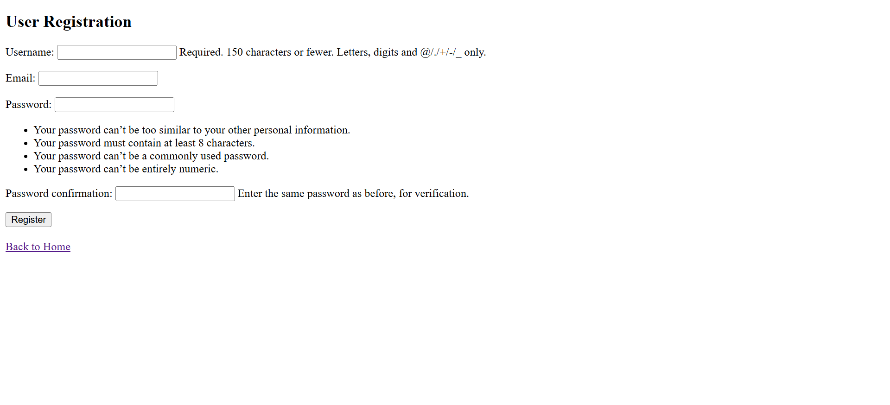
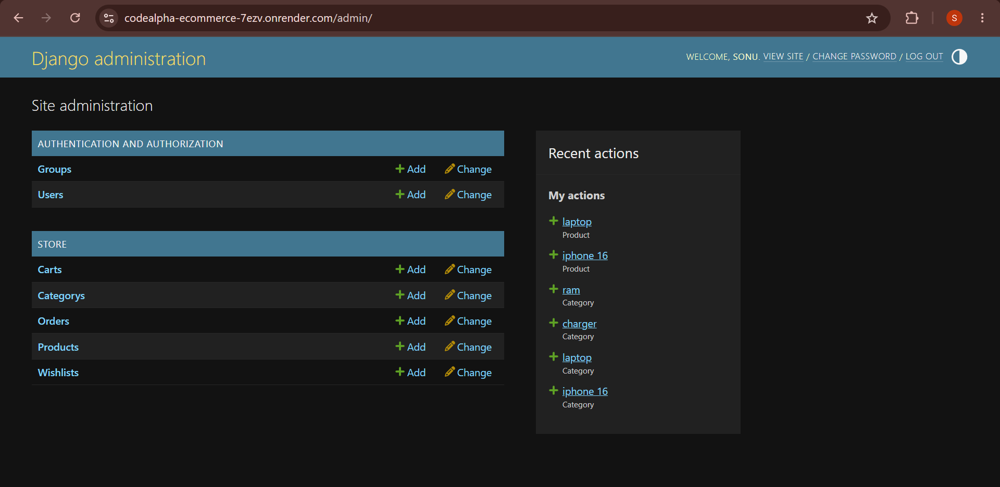
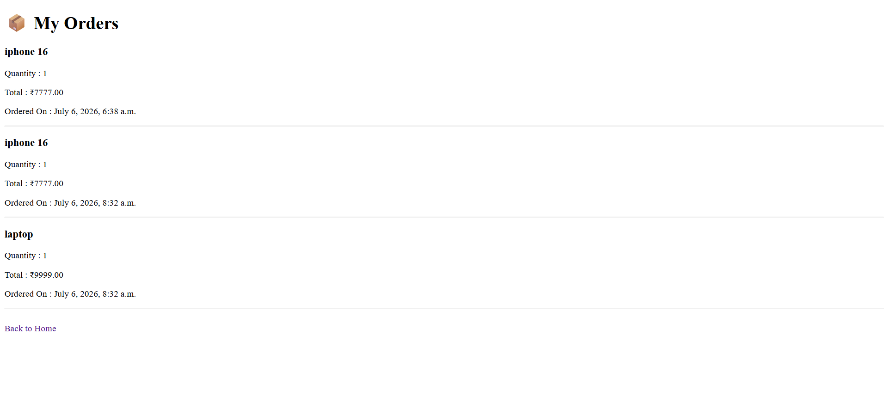

# 🛒 CodeAlpha E-Commerce Store

A Django-based **E-Commerce Web Application** developed as part of the **CodeAlpha Python Development Internship**. This application allows users to browse products, search items, manage a shopping cart and wishlist, place orders, and provides an admin panel for managing the store.

---

## 🚀 Live Demo

🔗 **https://codealpha-ecommerce-7ezv.onrender.com/**

---

## ✨ Features

- 🔐 User Registration & Login
- 🏠 Responsive Home Page
- 🔍 Product Search
- 📂 Category Filtering
- 📄 Product Details
- ❤️ Wishlist Management
- 🛒 Shopping Cart
- 💳 Secure Checkout
- 📦 Order History
- 👨‍💼 Django Admin Panel
- 📱 Mobile-Friendly UI

---

## 🖼️ Project Screenshots

### 🔐 Login Page


---

### 📝 Register Page



---

### 🏠 Home Page



---

### 🛍️ Store Page


---

### 🛒 Shopping Cart


---

### 💳 Checkout Page


---

### 📦 Order History



---

## 🛠️ Tech Stack

- Python
- Django
- SQLite
- HTML5
- CSS3
- Bootstrap
- JavaScript
- Render

---

## 📂 Project Structure

```
CodeAlpha_Ecommerce/
│
├── ecommerce/
├── products/
├── store/
├── screenshots/
│   ├── loginpage.png
│   ├── register.png
│   ├── homepage.png
│   ├── storepage.png
│   ├── cartpage.png
│   ├── checkoutpage.png
│   └── orderpage.png
│
├── manage.py
├── requirements.txt
├── render.yaml
├── build.sh
├── db.sqlite3
└── README.md
```

---

## ⚙️ Installation

### 1. Clone the Repository

```bash
git clone https://github.com/sonu-balagavi15/CodeAlpha_Ecommerce.git
```

### 2. Navigate to the Project Folder

```bash
cd CodeAlpha_Ecommerce
```

### 3. Create a Virtual Environment (Optional)

**Windows**

```bash
python -m venv venv
venv\Scripts\activate
```

**Linux / macOS**

```bash
python3 -m venv venv
source venv/bin/activate
```

### 4. Install Dependencies

```bash
pip install -r requirements.txt
```

### 5. Apply Database Migrations

```bash
python manage.py migrate
```

### 6. Create Superuser (Optional)

```bash
python manage.py createsuperuser
```

### 7. Start the Development Server

```bash
python manage.py runserver
```

Open your browser and visit:

```
http://127.0.0.1:8000/
```

---

## 👨‍💼 Admin Panel

Access the Django Admin Panel:

```
http://127.0.0.1:8000/admin/
```

Login using your superuser credentials.

---

## 🌟 Key Functionalities

- User Authentication
- Product Browsing
- Category-Based Filtering
- Product Search
- Shopping Cart
- Wishlist
- Checkout
- Order Management
- Admin Dashboard

---

## 📌 Future Improvements

- Online Payment Gateway Integration
- Product Reviews & Ratings
- Email Notifications
- User Profile Management
- Coupon & Discount System
- Product Recommendations
- Inventory Management

---

## 📄 License

This project was developed for educational purposes as part of the **CodeAlpha Python Development Internship**.

---

## 👩‍💻 Author

**Sonu Parashuram Balagavi**

🎓 B.E. Computer Science Engineering

💻 Python Developer | Django Developer | Web Developer

📧 Email: **sonubalagavi@gmail.com**

🔗 GitHub: https://github.com/sonu-balagavi15

---

## ⭐ Support

If you found this project helpful, please consider giving it a **⭐ Star** on GitHub.
