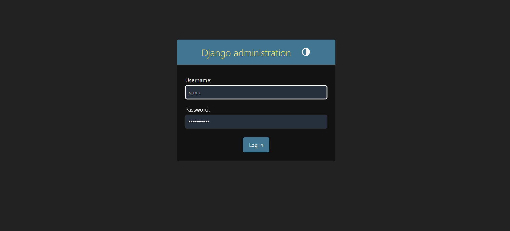
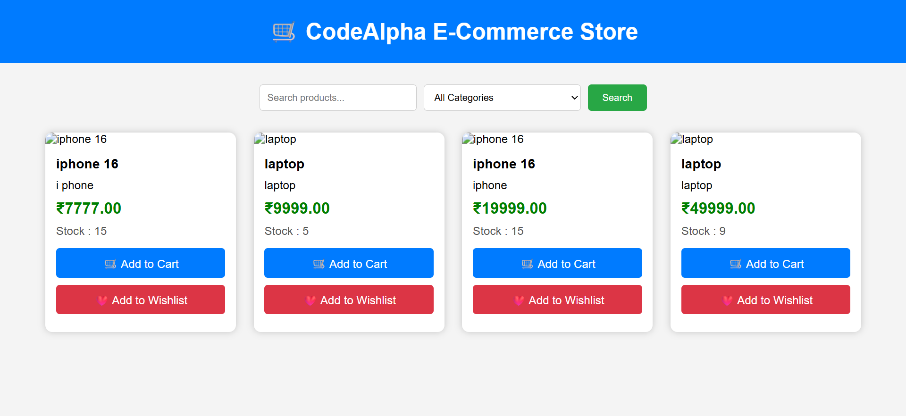
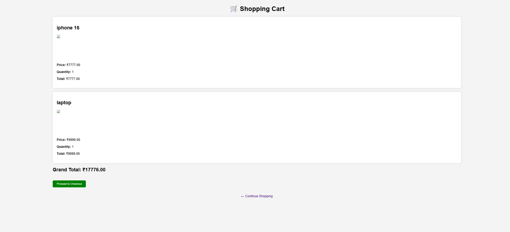
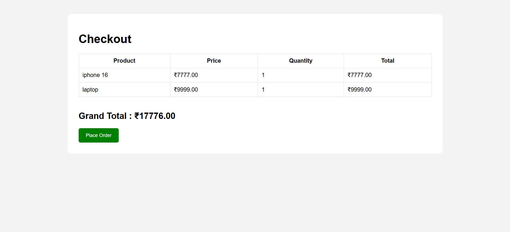

# 🛒 CodeAlpha E-Commerce Store

## 📌 Description

A Django-based E-Commerce Web Application developed as part of the **CodeAlpha Python Development Internship**. The project enables users to register, log in, browse products, search by category, manage a shopping cart and wishlist, place orders, and provides an admin panel for store management.

---

## ✨ Features

- 🔐 User Registration & Login
- 🏠 Home Page
- 🔍 Product Search
- 📂 Category Filter
- 📄 Product Details
- ❤️ Wishlist
- 🛒 Shopping Cart
- 💳 Checkout
- 📦 Order History
- 👨‍💼 Django Admin Panel
- 📱 Responsive Design

---

## 🖼️ Project Screenshots

### Login Page


### Register Page


### Home Page


### Product Search


### Shopping Cart


### Checkout


### Order History


---

## 🛠️ Tech Stack

- Python
- Django
- SQLite
- HTML5
- CSS3
- Bootstrap
- Render

---

## 🚀 Installation

Clone the repository:

```bash
git clone https://github.com/sonu-balagavi15/CodeAlpha_Ecommerce.git
```

Move into the project directory:

```bash
cd CodeAlpha_Ecommerce
```

Install dependencies:

```bash
pip install -r requirements.txt
```

Run migrations:

```bash
python manage.py migrate
```

Start the development server:

```bash
python manage.py runserver
```

Open your browser:

```
http://127.0.0.1:8000/
```

---

## 🌐 Live Demo

https://codealpha-ecommerce-7ezv.onrender.com/

---

## 👤 Author

**Sonu Balagavi**

Python Developer | Django Developer
